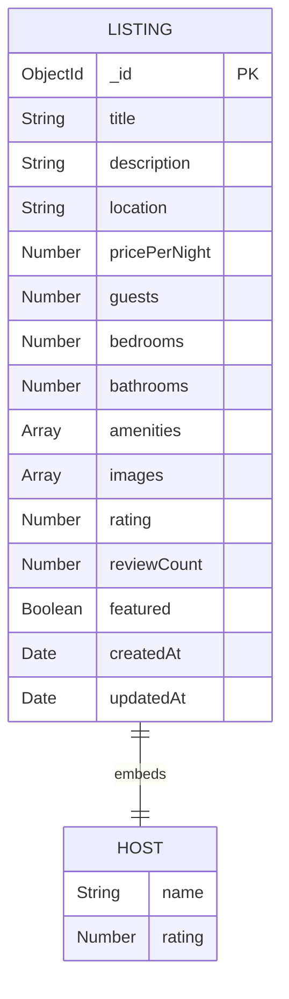

# Homestay AI

An AI-powered homestay platform that helps travelers discover accommodations and receive personalized travel recommendations while enabling hosts to manage bookings efficiently.

## Tech Stack

### Frontend
- React 19 (Vite 8)
- Tailwind CSS v4
- React Router v7

### Backend
- Node.js
- Express.js
- MongoDB Atlas (cloud database)
- Mongoose ODM

### AI Integration
- Google Gemini 2.0 Flash (review sentiment analysis)

### Planned (Future Weeks)
- Vercel + Render deployment

---

## Project Structure

```
homestay-ai/
├── frontend/              # React + Vite app
│   ├── src/
│   │   ├── api/           # API client (listingsApi.js)
│   │   ├── components/    # Navbar, Footer, Card, Hero
│   │   │   └── ui/        # Button, Input, Modal, Loader, Toast
│   │   ├── context/       # ThemeContext (dark/light mode)
│   │   ├── pages/         # Home, Listings, Dashboard, About, Login
│   │   ├── App.jsx
│   │   ├── main.jsx
│   │   └── index.css
│   └── package.json
│
├── backend/               # Express.js API
│   ├── config/            # Database connection (db.js)        ← Week 5
│   ├── controllers/       # listingController.js
│   ├── models/            # Listing.js (Mongoose schema)       ← Week 5
│   ├── routes/            # listingRoutes.js
│   ├── middleware/        # errorHandler.js, validateListing.js
│   ├── data/              # listings.js (seed data / reference)
│   ├── server.js
│   ├── seed.js            # Database seeder script              ← Week 5
│   ├── .env
│   ├── .env.example
│   └── package.json
│
└── README.md
```

---

## Setup & Run

### Prerequisites
- Node.js 18+
- npm
- MongoDB Atlas account (free tier works)

### 1. MongoDB Atlas Setup

1. Go to [MongoDB Atlas](https://www.mongodb.com/cloud/atlas) and create a free account
2. Create a new cluster (free M0 tier)
3. Create a database user with a username and password
4. Add your IP address to the IP Access List (or use `0.0.0.0/0` for development)
5. Click **Connect** → **Connect your application** → Copy the connection string
6. Replace `<username>`, `<password>`, and `<cluster>` in the connection string

### 2. Environment Variables

Copy `.env.example` to `.env` in the backend folder:

```bash
cd backend
cp .env.example .env
```

Fill in your values:

```
PORT=5000
NODE_ENV=development
CLIENT_URL=http://localhost:5173
MONGODB_URI=mongodb+srv://<username>:<password>@<cluster>.mongodb.net/homestay-ai?retryWrites=true&w=majority
JWT_SECRET=your_jwt_secret_here
GEMINI_API_KEY=your_gemini_api_key_here
```

#### Getting a Gemini API Key

1. Go to [Google AI Studio](https://aistudio.google.com/app/apikey)
2. Click **Create API Key**
3. Copy the key and paste it as `GEMINI_API_KEY` in your `.env` file

> ⚠ **Never commit `.env` to version control.** It is already listed in `.gitignore`.

### 3. Backend

```bash
cd backend
npm install
npm run seed     # Populate database with sample listings
npm run dev      # Start development server
```

Server starts at **http://localhost:5000**

### 4. Frontend

```bash
cd frontend
npm install
npm run dev
```

App opens at **http://localhost:5173**

---

## Database

### Why MongoDB Atlas?

- **Document model** — listings are naturally represented as JSON-like documents with nested objects (host) and arrays (amenities, images)
- **Free tier** — MongoDB Atlas M0 provides 512 MB free storage, perfect for development
- **Mongoose ODM** — provides schema validation, type casting, and query building that integrates cleanly with Express
- **Persistence** — data survives server restarts (unlike the Week 4 in-memory store)

### Schema Diagram



### Listing Schema Details

| Field | Type | Required | Default | Validation |
|-------|------|----------|---------|------------|
| `title` | String | ✅ | — | trimmed |
| `description` | String | ❌ | `''` | trimmed |
| `location` | String | ✅ | — | trimmed |
| `pricePerNight` | Number | ✅ | — | min: 1 |
| `guests` | Number | ❌ | `1` | min: 1 |
| `bedrooms` | Number | ❌ | `1` | min: 0 |
| `bathrooms` | Number | ❌ | `1` | min: 0 |
| `amenities` | [String] | ❌ | `[]` | — |
| `images` | [String] | ❌ | `[]` | — |
| `host.name` | String | ❌ | `'New Host'` | trimmed |
| `host.rating` | Number | ❌ | `0` | 0–5 |
| `rating` | Number | ❌ | `0` | 0–5 |
| `reviewCount` | Number | ❌ | `0` | min: 0 |
| `featured` | Boolean | ❌ | `false` | — |
| `createdAt` | Date | auto | — | Mongoose timestamps |
| `updatedAt` | Date | auto | — | Mongoose timestamps |

---

## API Endpoints

| Method   | Endpoint                     | Description            | Status Codes     |
|----------|------------------------------|------------------------|------------------|
| `GET`    | `/api/health`                | Health check           | 200              |
| `GET`    | `/api/listings`              | All listings           | 200              |
| `GET`    | `/api/listings/featured`     | Featured listings only | 200              |
| `GET`    | `/api/listings/search?q=`    | Search / filter        | 200, 400         |
| `GET`    | `/api/listings/:id`          | Single listing         | 200, 404         |
| `POST`   | `/api/listings`              | Create listing         | 201, 400         |
| `PUT`    | `/api/listings/:id`          | Update listing         | 200, 400, 404    |
| `DELETE` | `/api/listings/:id`          | Delete listing         | 204, 404         |
| `POST`   | `/api/reviews/analyze`       | AI review analysis     | 200, 400, 401, 429, 502 |

### Search Query Parameters

| Param      | Type   | Description                    |
|------------|--------|--------------------------------|
| `q`        | string | Keyword search (title, desc, location, amenities) |
| `location` | string | Filter by location             |
| `minPrice` | number | Minimum price per night        |
| `maxPrice` | number | Maximum price per night        |
| `guests`   | number | Minimum guest capacity         |

---

## Project Status

- **Week 1**: Repository initialization and project planning
- **Week 2**: Component library (Button, Input, Modal, Loader, Toast)
- **Week 3**: Pages, routing, dark mode, responsive layout
- **Week 4**: Backend API (Express.js), frontend integration, CRUD operations
- **Week 5**: MongoDB Atlas integration, Mongoose ODM, schema design, database seeder
- **Week 6**: JWT authentication (local + Google OAuth), protected routes, rate limiting
- **Week 7**: AI integration (Google Gemini), review sentiment analysis, prompt engineering